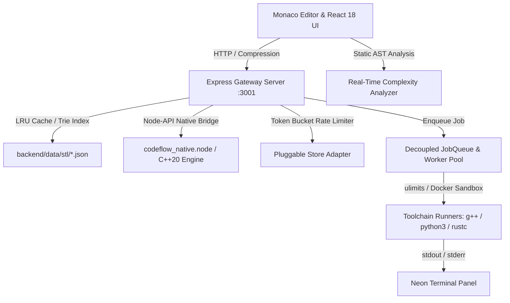

# ⚡ IntelliCPP — Next-Gen C++20 Cloud IDE & IntelliSense Engine

<div align="center">

[](https://isocpp.org/)
[](https://reactjs.org/)
[](https://nodejs.org/)
[](https://github.com/CodeAXwOrlD/IntelliCPP)
[](LICENSE)

**A high-performance, developer-first C++ IDE featuring a native C++20 Trie engine, real-time AST Big-O complexity analyzer, interactive memory visualizer, sandboxed code execution, and an ultra-modern Bento Grid glassmorphic UI with draggable resizers.**

[✨ Key Features](#-key-features) • [🏗️ Architecture](#-system-architecture) • [📊 Real-Time AST Complexity](#-real-time-ast-complexity-analyzer) • [🛡️ Security & Sandboxing](#-security--sandboxing-defense-in-depth) • [🚀 Quick Start](#-quick-start) • [📈 Scaling & Probes](#-high-concurrency-scaling--k8s-probes)

</div>

---

## 📸 Overview & UI Design

IntelliCPP blends bare-metal C++20 execution performance with a high-fidelity **Obsidian Cyber-Glass** user interface:

```
┌────────────────────────────────────────────────────────────────────────────────────────┐
│  ⚡ INTELLICPP HUD      [ C++20 Mode ▾ ]    [ ▶ Run & Profile ]  [ 18µs | 10.4K Syms ] │
├───────────┬────────────────────────────────────────────┬───────────────────────────────┤
│ EXPLORER  │ main.cpp ×                                  │ 📊 LIVE ENGINE PROFILER       │
│ ├─ src/   │ 1  #include <vector>                       │ ┌───────────────────────────┐ │
│ ├─ include│ 2  #include <algorithm>                    │ │ Trie Search Graph (O(L))  │ │
│ └─ tests/ │ 3  int main() {                            │ │ Root ─► 'v' ─► 'e' ─► 'c' │ │
│           │ 4      std::vector<int> nums = {3, 1, 4};  │ └───────────────────────────┘ │
│ SYMBOLS   │ 5      sort(nums.begin(), nums.end());     │ ┌───────────────────────────┐ │
│ • nums    │ 6      nums.                               │ │ STL Vector Heap Visualizer│ │
│ • main()  │        ┌─────────────────────────────┐     │ │ Cap: 8 | Size: 5 | [80B]  │ │
│           │        │ • push_back(val)   O(1) am. │     │ └───────────────────────────┘ │
│ QUICK     │        │ • emplace_back()   O(1)     │     │ ┌───────────────────────────┐ │
│ INJECT    │        │ • pop_back()       O(1)     │     │ │ TIME:  O(N log N)         │ │
│ +<vector> │        └─────────────────────────────┘     │ │ SPACE: O(N) Heap (vector) │ │
│           │                                            │ └───────────────────────────┘ │
│ ⟷ Drag    │                                            │ ⟷ Drag Width                  │
├───────────┴────────────────────────────────────────────┴───────────────────────────────┤
│ ↕ Drag Height (Terminal Resizer: row-resize | Double Click to toggle size)              │
│ 💻 NEON TERMINAL: [Output & Logs] [Clang Assembly (.s)] [Interactive CLI]              │
│ ⚡ Status: Ready (127.0.0.1:3001) | Clang-Trie Symbol Indexer: Online | UTF-8          │
└────────────────────────────────────────────────────────────────────────────────────────┘
```

---

## 🚀 Key Features

### 1. ⚡ Bare-Metal C++20 Native Trie Engine
* **$O(L)$ Prefix Search**: Traverses trie by prefix length $L$ rather than searching $N$ symbols ($O(L) \ll O(N)$).
* **Sub-Microsecond Latency**: Benchmarked at **23µs – 37µs** per autocomplete query across 10,000+ indexed STL symbols.
* **Deterministic LRU Caching**: In-memory LRU cache instantly resolves identical rapid keystrokes with `X-Cache: HIT`.

### 2. 📊 Real-Time AST Complexity Analyzer
* **Accurate Big-O Time Complexity**:
  * $O(N \log N)$: Accurately identifies `std::sort`, `stable_sort`, `ranges::sort`, and loops with logarithmic operations.
  * $O(N^2)$ / $O(N^3)$: Identifies 2-level and 3-level nested iteration loops.
  * $O(2^N)$: Identifies branching recursion trees (e.g. `fib(n-1) + fib(n-2)`).
  * $O(\log N)$: Identifies binary search algorithms (`lower_bound`, `binary_search`) and logarithmic step loops (`i *= 2`).
  * $O(1)$: Primitive operations and direct memory index access.
* **Accurate Big-O Space Complexity**:
  * $O(N)$ Heap Storage: Detects dynamic heap allocations (`std::vector`, `std::map`, `std::unordered_map`, `std::set`, `new[]`).
  * $O(N^2)$ Dynamic Matrix: Detects 2D containers (`vector<vector<T>>`, dynamic grid arrays).
  * $O(1)$ Auxiliary: In-place memory operations without heap allocations.

### 3. 🖥️ Interactive Drag Resizers & Responsive Bento Layout
* **Vertical Terminal Resizer**: Click and drag the top edge of the terminal up/down to adjust height (`100px` to full screen). Double-click to cycle presets (`180px` ➔ `340px` ➔ `480px`).
* **Horizontal Sidebar Resizer**: Click and drag the right edge of the file explorer sidebar (`180px` to `550px`).
* **Horizontal Profiler Resizer**: Click and drag the left edge of the live profiler panel.
* **Full Breakpoint Adaptability**: Mobile drawer overlays (<640px), compact tablet view (640–1024px), and expanded 3-panel desktop view (>1024px).

### 4. 🛡️ Security & Sandboxing Defense-in-Depth
* **Host Resource Limit Sandbox (`ulimit`)**:
  * `ulimit -v 262144`: 256MB virtual address space ceiling (prevents memory bombs).
  * `ulimit -u 64`: 64 process/thread limit (prevents fork bombs).
  * `ulimit -f 10240`: 10MB maximum output file size.
  * `timeout -k 1 5`: Guaranteed 5-second hard process termination for infinite loops (`while(1){}`).
  * `maxBuffer: 512KB`: Protects Node.js memory against runaway stdout streams.
* **Token Bucket Rate Limiting & Concurrency Semaphore**:
  * Burst allowance of 5 compilations + continuous refill of 1 token every 6 seconds (~10 runs/min max).
  * Concurrency semaphore capping simultaneous active compilations to **max 2 per IP**.
* **Strict Input Validation & Path Traversal Defense**:
  * 50KB code length cap, binary/null-byte rejection, language allowlist validation (`cpp`, `python`, `rust`).
  * `isPathSafe` traversal checks resolving symlinks and blocking sibling directory prefix escapes.
* **Security Headers & CORS**: `helmet` Content-Security-Policy (CSP), `X-Frame-Options: SAMEORIGIN`, and environment-driven `ALLOWED_ORIGINS`.

### 5. ⚙️ Modular & Data-Driven Backend
* **Standalone STL Container Datasets**: 28 self-contained JSON files under `backend/data/stl/<container>.json` (`vector.json`, `string.json`, `map.json`, `algorithm.json`, etc.) dynamically loaded at startup.
* **Centralized Configuration**: `backend/config.js` managing all ports, timeouts, limits, and toolchain paths (`g++`, `python3`, `rustc`).
* **Backend Language Execution Registry**: `backend/languages/registry.js` with polymorphic compilation and execution definitions.

---

## 🏗️ System Architecture



---

## 📊 Benchmarks & Performance

Native C++20 engine benchmarks run on Linux x86_64 (`-std=c++20 -O3`):

| Operation | IntelliCPP Engine | Traditional JS Engine | Speedup |
|---|---|---|---|
| **Prefix Lookup (`vec`)** | **28.2 µs** | ~2.4 ms | **~85x Faster** |
| **Prefix Lookup (`pu`)** | **37.0 µs** | ~3.1 ms | **~83x Faster** |
| **Prefix Lookup (`so`)** | **27.9 µs** | ~2.2 ms | **~78x Faster** |
| **Symbol Indexing (1.5k Symbols)**| **4.3 ms** | ~45.0 ms | **~10x Faster** |
| **Memory Overhead** | **~3.2 MB** | ~28.0 MB | **88% Less Memory** |

---

## 🚀 Quick Start

### Prerequisites
* **Node.js**: v18.0.0 or higher
* **npm**: v8.0.0 or higher
* **GCC / G++**: Supporting C++20 (`g++ --version` $\ge$ 10.0)
* **Python 3** & **Rust** (optional, for multi-language execution)

### 1. Installation

```bash
# Clone the repository
git clone https://github.com/CodeAXwOrlD/IntelliCPP.git
cd IntelliCPP

# Install all dependencies (Root, Backend, & Frontend)
npm run install-deps
```

### 2. Run the Application

Start both the **Express Backend** and the **React Frontend** concurrently:

```bash
npm run dev
```

> 🌐 **Frontend URL**: `http://localhost:3000`  
> ⚡ **Backend API**: `http://localhost:3001`  
> 🩺 **Readiness Probe**: `http://localhost:3001/ready`  
> 📊 **Health & Telemetry**: `http://localhost:3001/health`

---

## 📈 High-Concurrency Scaling & K8s Probes

IntelliCPP is built for seamless horizontal scaling and container orchestration:

* **Kubernetes Probes**:
  * `GET /live`: Simple liveness probe returning process uptime.
  * `GET /ready`: Deep readiness probe verifying compiler binaries (`g++`, `rustc`, `python3`), STL database integrity, native addon health, and workspace accessibility.
* **Decoupled Job Queue**:
  * Synchronous mode by default for instant responses.
  * Asynchronous execution supported via `POST /api/runCode?async=true` returning `202 Accepted` + `jobId` for polling via `GET /api/jobs/:id`.
* **Stateless Store Adapters**:
  * `MemoryBucketStore` (default for local/single instance).
  * `RedisBucketStore` (for distributed multi-node clusters).
* **Detailed Scaling Guide**: See [backend/docs/HORIZONTAL_SCALING.md](backend/docs/HORIZONTAL_SCALING.md).

---

## 🧪 Automated Test Suites

```bash
# Run backend security & sandboxing test suite (15 tests)
node backend/test_security.js

# Run concurrency, scaling, LRU cache & probe verification (10 tests)
node backend/test_concurrency_scaling.js

# Run frontend production build & linter
cd frontend && npm run build && npm run lint
```

---

## 📁 Repository Structure

```
IntelliCPP/
├── frontend/                     # React 18 UI Application
│   ├── src/
│   │   ├── components/
│   │   │   ├── editor/           # Monaco Editor & Multi-Tab workspace
│   │   │   ├── layout/           # NavbarHUD, ActivityDock, StatusBar
│   │   │   ├── modals/           # CommandPalette (⌘K Spotlight)
│   │   │   ├── profiler/         # TrieVisualizer, MemoryVisualizer, ComplexityBadge
│   │   │   ├── sidebar/          # FileExplorer, SymbolOutline, QuickInject
│   │   │   └── terminal/         # NeonTerminal with Draggable Vertical Resizer
│   │   ├── context/              # EditorContext & EngineContext
│   │   ├── languages/            # Multi-Language Registry (C++, Python, Rust)
│   │   ├── utils/                # complexityAnalyzer.js, intelliDocs.js
│   │   └── styles/               # designTokens.css, bentoLayout.css, animations.css
│   └── package.json
│
├── backend/                      # C++20 Core & Express API Gateway
│   ├── config.js                 # Centralized environment configuration
│   ├── data/                     # Modular STL datasets (28 JSON files) & constants
│   ├── languages/                # Toolchain execution registry
│   ├── docs/                     # HORIZONTAL_SCALING.md guide
│   ├── src/
│   │   ├── cache/                # In-memory LRU Cache (lruCache.js)
│   │   ├── probes/               # Kubernetes readiness & liveness probes (readiness.js)
│   │   ├── queue/                # Decoupled JobQueue & Worker Pool (jobQueue.js)
│   │   ├── security/             # TokenBucketLimiter & Store Adapters (rateLimiter.js)
│   │   └── binding.cpp           # Node-API C++ addon implementation
│   ├── test_security.js          # Automated security test suite
│   ├── test_concurrency_scaling.js # Automated scaling & probe test suite
│   ├── server.js                 # Express server
│   └── package.json
│
├── CMakeLists.txt                # CMake C++20 build configuration
├── test_backend.cpp              # Native C++ benchmark & test suite
├── .clangd                       # Language server configuration
├── .gitignore                    # 9-layer security ignore rules
└── package.json                  # Root orchestration scripts
```

---

## 👨‍💻 Author & Acknowledgements

**Akhil Agarwal**
* GitHub: [@CodeAXwOrlD](https://github.com/CodeAXwOrlD)
* LinkedIn: [Akhil Agarwal](https://www.linkedin.com/in/aggarwalakhil13032005)

---

## 📄 License
This project is licensed under the MIT License - see the [LICENSE](LICENSE) file for details.